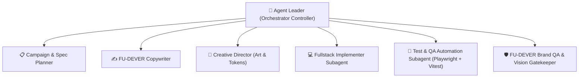

# AGENTS.md — "Deploy Ước Mơ" Autonomous Engineering & Orchestration Framework

Hệ thống điều phối Agent tự động hóa dựa trên phương pháp luận **Superpowers SDD (Subagent-Driven Development)** kết hợp **FU-DEVER Orchestrator**.

---

## 1. Vai trò & Phân quyền Agent (Agent Hierarchy)

### 1.1 Agent Leader (Controller)
- Giữ vai trò điều phối tổng thể, theo dõi tiến độ các MVP, phân công nhiệm vụ cụ thể cho từng subagent.
- Duy trì **Single Source of Truth** (`spec-deploy-uoc-mo.md`, `design-deploy-uoc-mo.md`, `task-list-deploy-uoc-mo.md`).
- Quyết định xử lý xung đột (Rulings), ghi chép Progress Ledger và kích hoạt chu trình Fix Loop nếu kiểm thử phát hiện lỗi.

### 1.2 Subagent Chuyên trách
1. **Frontend / Fullstack Implementer (`fu-dever-poster-producer` / `subagent-implementer`)**:
   - Khởi tạo và code Next.js 15, React, Tailwind CSS, TypeScript, Canvas render, SSE / Supabase Realtime.
   - Tuân thủ tiêu chuẩn code sạch, không hardcode bừa bãi, hỗ trợ offline local lẫn cloud deploy.
2. **Creative Director & Asset Manager (`fu-dever-creative-director`)**:
   - Quản lý kho tài nguyên thương hiệu từ `DEVER Collection` (Logo FU-DEVER, Mascot Buggy, Bảng màu Trung Thu `#12203A`, `#993C1D`, `#FAC775`, `#FAEEDA`, `#0091EA`).
   - Đảm bảo tỷ lệ thẩm mỹ Swiss 8pt Grid, WCAG AAA contrast, Vietnamese font rendering không lỗi dấu.
3. **Tester & QA Subagent (`fu-dever-brand-qa` + Playwright Subagent)**:
   - Viết unit test cho logic xử lý dữ liệu và E2E tests bằng Playwright cho mọi user flows.
   - Kiểm tra visual snapshot và xác thực tiêu chuẩn trước khi hoàn thành.

---

## 2. Quy trình MVP & Loop Thực thi (Execution Loop)

Mỗi giai đoạn MVP phải trải qua chu trình 4 bước:
1. **Spec & Task Briefing**: Lấy requirements từ task list và design spec.
2. **TDD / Implementation**: Viết mã nguồn, tích hợp UI và logic.
3. **Automated Verification**: Chạy unit test + Playwright test + build check.
4. **Gate Review**: Nếu test FAIL → kích hoạt Fix Loop (tối đa 5 round) giải quyết triệt để lỗi trước khi chuyển sang MVP tiếp theo.

---

## 3. Brand Assets & Tokens

- **Màu chủ đạo**:
  - Night Sky Display: `#12203A`
  - Deep Red Lantern & Cards: `#993C1D`, `#712B13`
  - Warm Amber Gold: `#FAC775`, `#FAEEDA`
  - Brand Blue Accent: `#0091EA`, `#85B7EB`
- **Tài nguyên**:
  - Logo chính thức: `public/assets/logo/` (FU-DEVER vector/high-res transparent)
  - Buggy Mascot: `public/assets/buggy/` (Sticker Buggy bọ cánh cam)
  - Audio / SFX: âm thanh nhẹ khi thả đèn lồng.
