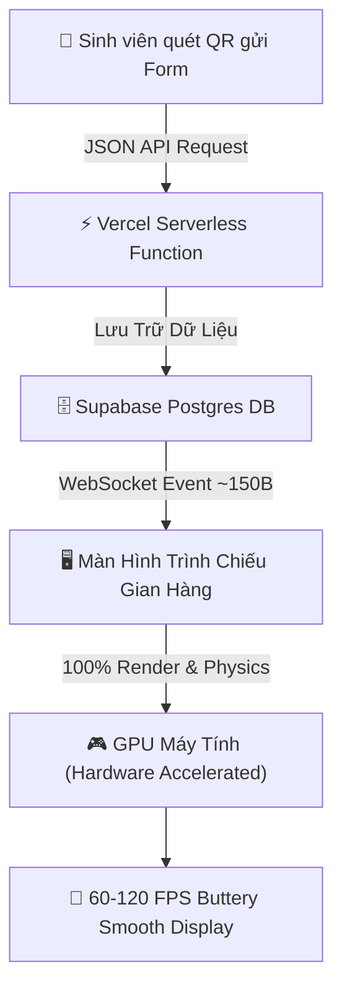

<p align="center">
  
</p>

<h1 align="center">🏮 DEPLOY ƯỚC MƠ — FU-DEVER CLUB DAY 2026</h1>

<p align="center">
  <strong>Hệ thống tương tác đa nền tảng: Thả Đèn Lồng Ước Mơ & Xuất Thiệp Story 9:16 Cá Nhân Hóa Dành Cho Tân Sinh Viên K22</strong>
  <br />
  <em>CLB Lập Trình FU-DEVER — Trường Đại Học FPT Đà Nẵng</em>
</p>

<p align="center">
  <a href="https://nextjs.org"></a>
  <a href="https://react.dev"></a>
  <a href="https://www.typescriptlang.org"></a>
  <a href="https://tailwindcss.com"></a>
  <a href="https://supabase.com"></a>
  <a href="https://vercel.com"></a>
</p>

---

## 📖 Giới Thiệu Dự Án

**"Deploy Ước Mơ"** là sản phẩm công nghệ trọng điểm của **CLB Lập trình FU-DEVER** tại ngày hội **Club Day 2026**. Dự án được thiết kế để chào đón tân sinh viên **K22**, mang đến trải nghiệm thả đèn lồng số hóa mang đậm bản sắc văn hóa Trung Thu truyền thống hòa quyện cùng tinh thần sáng tạo công nghệ của sinh viên IT.

Sinh viên chỉ cần quét mã QR tại gian hàng để gửi gắm những hoài bão học tập, sự nghiệp và cuộc sống. Ngay lập tức, chiếc đèn lồng mang tên bạn cùng lời ước nguyện sẽ bay lơ lửng trên màn hình lớn gian hàng và tạo ra tấm thiệp **Dream Card Story (9:16)** độc quyền để chia sẻ lên mạng xã hội!

---

## ✨ Tính Năng Nổi Bật

### 📱 1. Soạn & Gửi Ước Mơ (Mobile-First `/`)
* **Giao diện ấm cúng & Sang trọng**: Bảng màu Trung Thu hoàng kim (`#FAC775`, `#993C1D`, `#12203A`) chuẩn phong cách lễ hội truyền thống.
* **Gieo Vần Thơ DEVER (AI Poetry Engine)**: Tự động gieo những vần thơ lục bát / tứ tuyệt mang tên bạn và chủ đề ước nguyện.
* **6 Dáng Đèn Lồng Độc Quyền**: Đèn Lụa Hội An, Đèn Ông Sao, Đèn Kéo Quân, Đèn Củ Tỏi Quý Tộc, Đèn Cá Chép Vượt Sóng, Đèn Cyber Neon DEVER.
* **Bộ Sưu Tập Biểu Cảm Linh Vật Buggy**: 8 sắc thái cảm xúc của chú bọ cánh cam Buggy đồng hành cùng coder.
* **Thanh Thả Cảm Xúc Live Reactions**: Thả tim, pháo hoa, tên lửa bay lên màn hình Display theo thời gian thực.
* **Hỗ trợ PWA (Progressive Web App)**: Cài đặt trực tiếp lên màn hình chính điện thoại mượt mà như Native App.

### 🌌 2. Bầu Trời Đèn Lồng Trình Chiếu Display (`/display`)
* **Hiệu năng cực đại 60–120 FPS**: Ứng dụng kỹ thuật **Direct DOM Transform & GPU Hardware Acceleration**, giải phóng 100% CPU của Server và trình duyệt.
* **3 Chế Độ Chuyển Động Độc Đáo**:
  * 🔄 **Bay Xoay Vòng 3D (Carousel Orbit)**: Quỹ đạo elip nghiêng 3D đảm bảo 100% ước mơ đều lần lượt xuất hiện rõ nét ở tiền cảnh.
  * 🍃 **Trôi Tự Do (Organic Drift)**: Đèn lồng nảy nổi bồng bềnh tự nhiên theo ngọn gió thu.
  * 🌐 **Chòm Sao Thiên Hà (Constellation Galaxy)**: Kết nối các ước mơ cùng chủ đề thành mạng lưới chòm sao lấp lánh.
* **Tiêu Điểm Ước Mơ (Auto-Spotlight)**: Tự động xoay tua làm nổi bật những lời chúc truyền cảm hứng mỗi 12 giây.
* **Âm Thanh Thủ Tục (Web Audio API Procedural Synthesizer)**: Tiếng chuông khánh thanh tao khi thả đèn và nhạc nền ngũ cung êm dịu, không cần load file MP3 ngoài.

### 🎨 3. Studio Xuất Ảnh Thiệp Dream Card (Story 9:16)
* **Chuẩn tỷ lệ HD 1080×1920px**: Đóng dấu triện đỏ Đỗ Đạt, logo FU-DEVER, sticker Buggy và lời chúc.
* **AR Polaroid Photo Booth**: Chụp ảnh kỷ niệm trực tiếp qua Camera điện thoại lồng khung ảnh gian hàng ngày hội.

### 🛡️ 4. Trung Tâm Điều Hành Gian Hàng (`/admin`)
* **Live Announcement Broadcaster**: Phát thanh thông báo khẩn cấp trực tiếp lên toàn bộ màn hình Display.
* **Thử Nghiệm Gian Hàng (Rehearsal Simulator)**: Tạo nhanh 5 ước mơ mẫu sinh động để test hệ thống trước giờ G.
* **Phân Tích Từ Khóa Xu Hướng (Word Cloud Analyzer)**: Tự động trích xuất các từ khóa hot nhất trong ước mơ sinh viên.
* **Xuất Dữ Liệu CSV & JSON**: Hỗ trợ xuất file Excel tiếng Việt UTF-8 BOM chuẩn xác.
* **Vòng Quay May Mắn (`/admin/lucky-draw`)**: Minigame bốc thăm trúng quà gian hàng (Sticker, Áo CLB, Voucher).

### 🖨️ 5. Poster Standee Chuẩn In Ấn (`/standee`)
* Mẫu Standee tỷ lệ dọc chuẩn 60x160cm chứa mã QR sắc nét, linh vật Buggy và hướng dẫn tham gia.

---

## 🏗️ Kiến Trúc Tối Ưu Serverless & GPU Offloading



* **Vercel Serverless**: Chỉ xử lý JSON API thô, giải phóng tài nguyên trong <20ms, tải trọng server gần như bằng 0.
* **Supabase Realtime WebSockets**: Đẩy sự kiện trực tiếp đến màn hình với độ trễ <50ms.
* **Client-Side GPU Rendering**: Toàn bộ tính toán hình học 3D, hạt bụi sao Canvas và chuyển động bay được GPU máy tính tại gian hàng xử lý mượt mà.

---

## 🚀 Hướng Dẫn Cài Đặt & Chạy Môi Trường Local

### Yêu cầu tiên quyết:
- **Node.js**: Phiên bản `>= 18.18.0` hoặc `>= 20.0.0`
- **npm** hoặc **pnpm / yarn**

### Các bước thực hiện:

```bash
# 1. Clone mã nguồn
git clone https://github.com/fudever-club/deploy-uoc-mo-dever.git
cd deploy-uoc-mo-dever

# 2. Cài đặt các thư viện phụ thuộc
npm install

# 3. Thiết lập biến môi trường
cp .env.example .env.local

# 4. Khởi chạy môi trường phát triển (Local Dev)
npm run dev
```

Mở trình duyệt và truy cập:
- Trang gửi ước mơ: [http://localhost:3000](http://localhost:3000)
- Màn hình Sky Display: [http://localhost:3000/display](http://localhost:3000/display)
- Trang Quản trị viên: [http://localhost:3000/admin](http://localhost:3000/admin) *(Mật khẩu mặc định: `dever2026`)*
- Poster Standee: [http://localhost:3000/standee](http://localhost:3000/standee)

---

## 🧪 Kiểm Thử Tự Động (Automated Testing)

Dự án được bao phủ bởi bộ kiểm thử tự động toàn diện:

```bash
# Chạy Unit Tests với Vitest
npm run test

# Chạy End-to-End Tests với Playwright
npm run test:e2e

# Biên dịch kiểm tra Production Build
npm run build
```

---

## 🎨 Bảng Màu Nhận Diện Thương Hiệu (Design Tokens)

| Màu Sắc | Mã Hex | Ý Nghĩa / Vị Trí Áp Dụng |
| :--- | :--- | :--- |
| **Night Sky Display** | `#12203A` / `#0B132B` | Bầu trời đêm tĩnh lặng của màn hình chiếu |
| **Deep Red Lantern** | `#993C1D` / `#712B13` | Đèn lồng Trung Thu & thẻ ước nguyện truyền thống |
| **Imperial Gold** | `#FAC775` / `#FAEEDA` | Ánh trăng rằm hoàng kim & hào quang tỏa sáng |
| **Brand DEVER Blue** | `#0091EA` / `#85B7EB` | Xanh dương năng động của CLB Lập trình FU-DEVER |
| **Cyber Neon** | `#00F5D4` | Điểm nhấn viền công nghệ hiện đại |

---

## 👥 Về CLB Lập Trình FU-DEVER

**CLB Lập trình FU-DEVER** là tổ chức học thuật chuyên môn hàng đầu tại **Trường Đại học FPT Đà Nẵng**, nơi quy tụ những sinh viên đam mê Software Engineering, Web/Mobile Development, Artificial Intelligence và Competitive Programming (ICPC, Hackathon).

* **Fanpage Chính Thức**: [facebook.com/fudever.club](https://www.facebook.com/fudever.club)
* **GitHub Organization**: [github.com/fudever-club](https://github.com/fudever-club)
* **Email Liên Hệ**: `fudever.contact@gmail.com`
* **Địa Chỉ**: Tòa nhà FPT University, Khu đô thị FPT City, Ngũ Hành Sơn, Đà Nẵng

---

<p align="center">
  <strong>Made with ❤️ & 🏮 by FU-DEVER Engineering Team</strong>
  <br />
  <em>Deploy Ước Mơ — Chúc các bạn Tân Sinh Viên K22 một thời thanh xuân đại học rực rỡ!</em>
</p>
